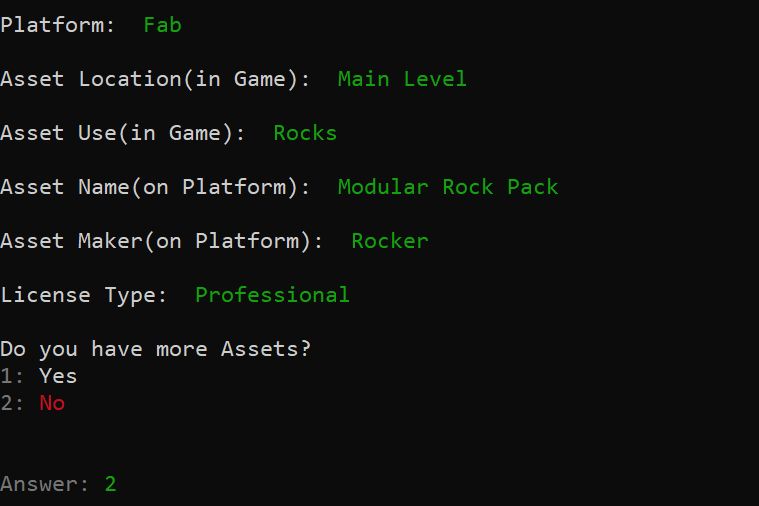

<link rel="stylesheet" href="/assets/css/style.css">

  

    <a href="/index.html">Home</a>
    <a href="/Projects/cpp.html">C++ Projects</a>
    <a href="/Projects/games.html">Game Projects</a>
    <a href="/Projects/python.html">Python Projects</a>
    <a href="/about.html">About Me</a>
  

# C++ Projects
A collection of systems‑level tools, simulations, and engine components written in modern C++.  
I focus on clarity, explicit logic, and predictable behavior — especially in combat systems and backend utilities.

This page will expand as more C++ projects are completed.

---

## 🎲 Monte Carlo Combat Simulator
A turn‑based combat simulation engine built in C++ with explicit win/loss return codes, deterministic turn order, and validated HP calculations.  
  
**[Highlights](https://github.com/AlvieSpurlock/TTRPGCombatBalanceSimulator)**
- Explicit `int` return codes for win/loss states  
- Deterministic turn sequencing  
- Randomized monster damage with validation  
- Clean, minimal architecture  
- Designed for extensibility (future: crits, resistance, logs)

---

## Asset Logger
A console based Indie Dev tool for Steam Submissions and Asset Inventory. It guides you through adn takes input of your assets, their location, their purpose, who made them, their platform, and your license type then saves it into a structured .csv.  
  
**[Highlights](https://github.com/AlvieSpurlock/AssetLogger)**
- Guided, step‑by‑step asset entry workflow
- Input validation to prevent missing or malformed fields
- Automatic formatting into a clean, Steam‑ready CSV
- Multi‑asset session support with confirmation prompts
- Overwrite protection for existing CSV files
- Minimal, readable console UI designed for speed and clarity
- Built for extensibility (future: presets, batch import, tagging)

---
## 🧱 Future C++ Systems
Planned or in‑progress C++ projects that will be added here:

- **File I/O Helper** — A tool to HEAVILY Simplify the processes of File I/O
- **cRNG** — A tool for easier RNG ranging from Dice Rolls to Monte Carlo Framework
- **cPhysics** — A tool to make Physics as easy as a few method calls.
- **RPG Tool** — A tool to make RPG Systems much easier. From Inventory and Dialogue Frameworks to Quests and AI Templates.

These will be added as they’re completed.

---

## 🔙 Back to Home 
- [Home](../index.md)
## Other Project Pages
- [Python](python.md)
- [Games](games.md)
