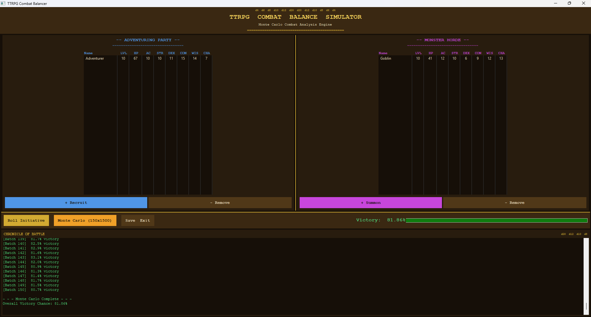
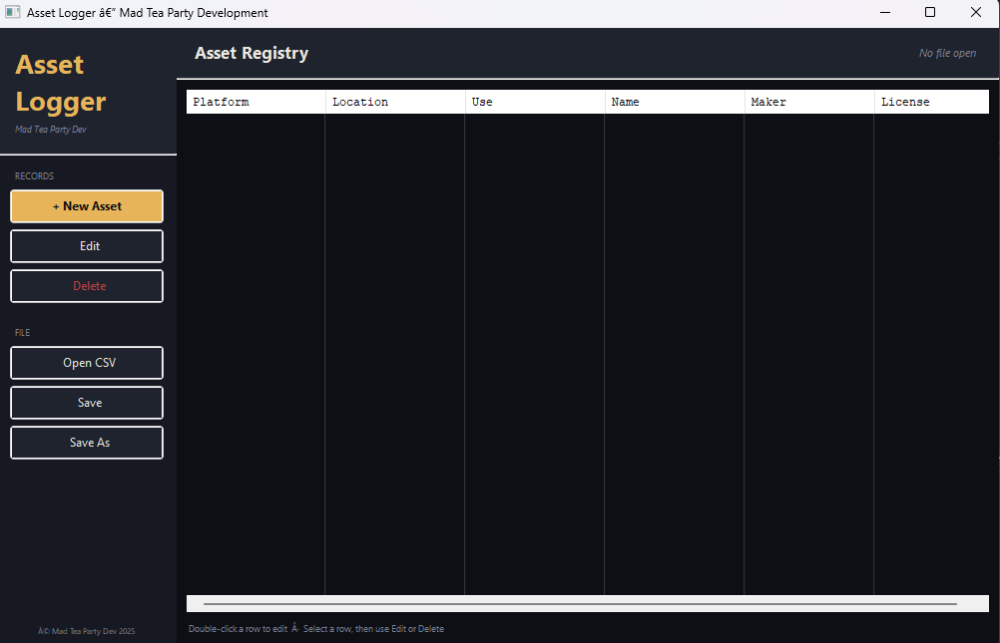

<link rel="stylesheet" href="/assets/css/style.css">

  

    <a href="/index.html">Home</a>
    <a href="/Projects/python.html">Python Projects</a>
    <a href="/Projects/cpp.html">C++ Projects</a>
    <a href="/Projects/games.html">Game Projects</a>
    <a href="/about.html">About Me</a>
  

# C++ Projects

A collection of systems-level tools, simulations, and desktop applications written in modern C++. I focus on clarity, explicit logic, and predictable behavior — from combat engines to developer utilities. All three active projects now ship as full wxWidgets desktop applications.

---

## 🎲 [TTRPG Combat Balance Simulator](https://github.com/AlvieSpurlock/TTRPGCombatBalanceSimulator)

A D&D-themed desktop combat simulator that runs **225,000 Monte Carlo trials** (150 batches × 1,500 combats) to estimate party win probability against any enemy configuration. Built with a full wxWidgets GUI, MCI/winmm audio engine, sprite sheet VFX animations, and a fullscreen dark-overlay presentation system.  
  

**Highlights**
- Monte Carlo engine: 150 × 1,500 simulations per run, threaded off the UI
- wxWidgets GUI — D&D parchment palette, animated VFX sprites, fullscreen overlays
- Character creator with 4d6-drop-lowest auto-roll and per-stat fire spell animations
- MCI/winmm audio — looping background music, pooled SFX aliases, interact sounds
- Full save/load persistence to `%AppData%` via structured CSV
- Explicit `int` return codes for win/loss states, deterministic turn sequencing
- Designed for extensibility (future: crits, resistances, spell slots)

---

## 📋 [Asset Logger](https://github.com/AlvieSpurlock/AssetLogger)

A desktop tool for indie developers preparing Steam submissions and managing asset inventory. Guides you through structured asset entry — location, purpose, creator, platform, and license — then exports a clean, Steam-ready CSV. Originally console-based, now featuring a full wxWidgets GUI.  
  

**Highlights**
- wxWidgets GUI — form-driven asset entry with live validation feedback
- Guided step-by-step workflow: location, purpose, author, platform, license
- Input validation to prevent missing or malformed fields
- Automatic formatting into a clean, Steam-ready CSV
- Multi-asset session support with confirmation prompts
- Overwrite protection for existing output files
- Built for extensibility (future: presets, batch import, tagging)

---

## 🧮 [Calculator](https://github.com/AlvieSpurlock/Calculator_CPP)

A desktop calculator built on a custom C++ expression engine with a full wxWidgets GUI. Moved beyond the standard console pattern to explore event-driven UI design, input parsing, and operator precedence handling as a proper standalone application.  

**Highlights**
- wxWidgets GUI with keyboard and button input
- Custom expression parser with correct operator precedence
- Clean event-driven architecture using wxWidgets `Bind()`
- Foundation for future scientific and programmer modes

---

## 🧱 Future C++ Systems

Planned or in-progress C++ projects that will be added here:

- **File I/O Helper** — A tool to heavily simplify the processes of File I/O
- **cRNG** — Easier RNG ranging from dice rolls to a full Monte Carlo framework
- **cPhysics** — Physics as easy as a few method calls
- **RPG Tool** — Inventory, dialogue, quests, and AI templates as a reusable framework

These will be added as they're completed.

---

## 🔙 Back to Home
- [Home](../index.md)

## Other Project Pages
- [Python](python.md)
- [Games](games.md)
