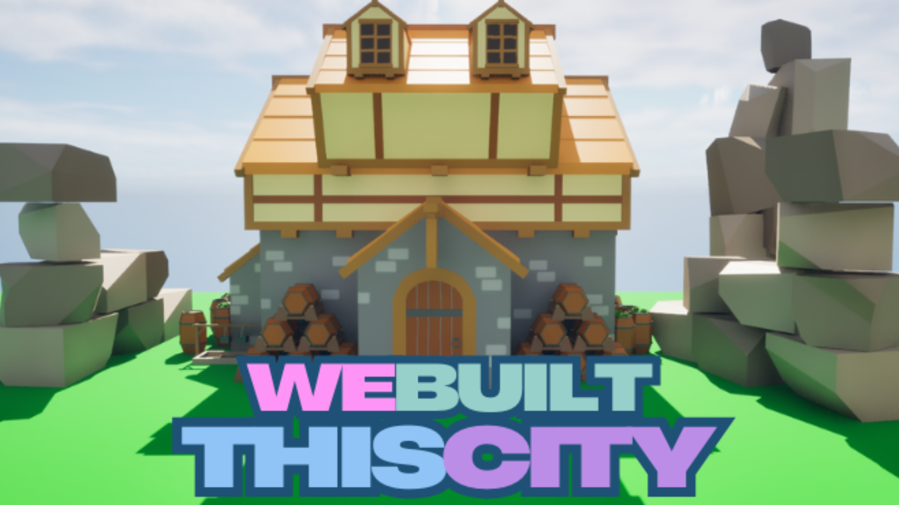
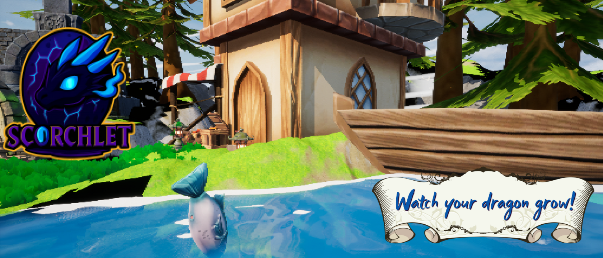
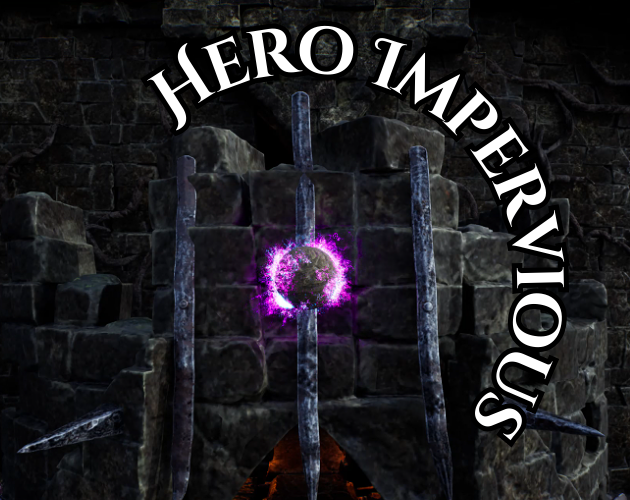
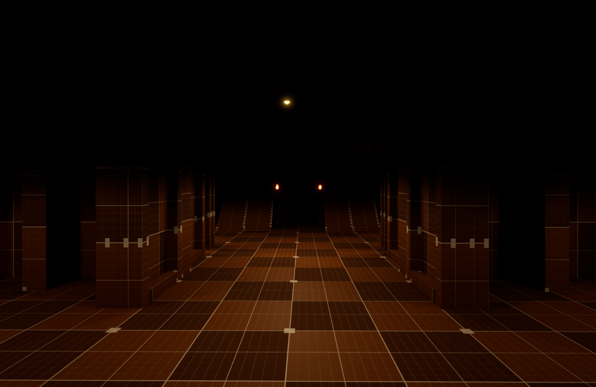
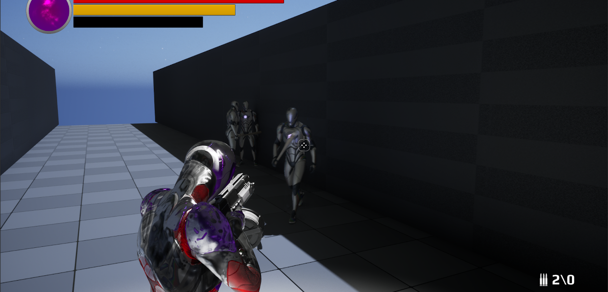
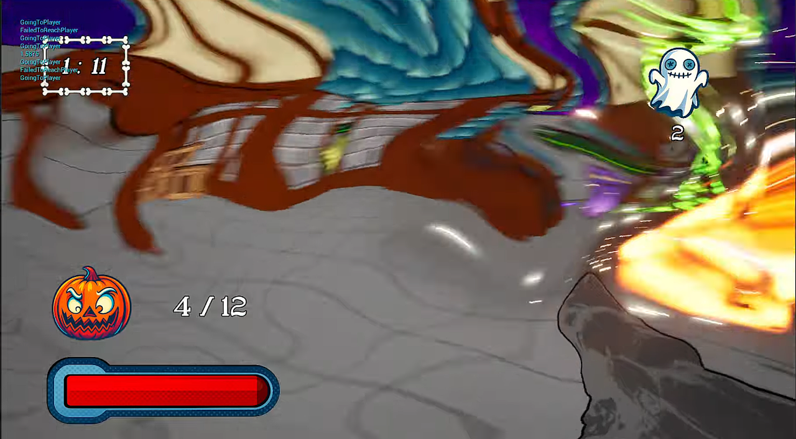
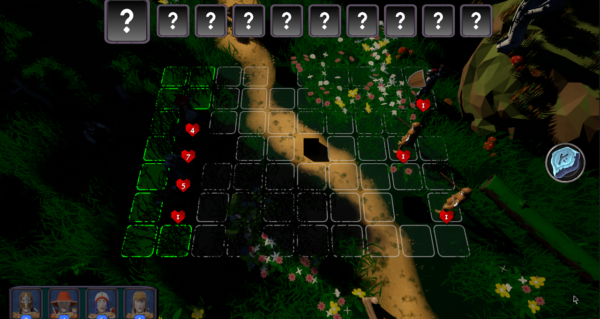
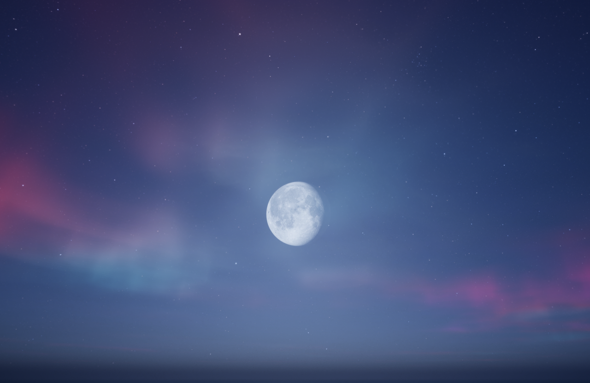
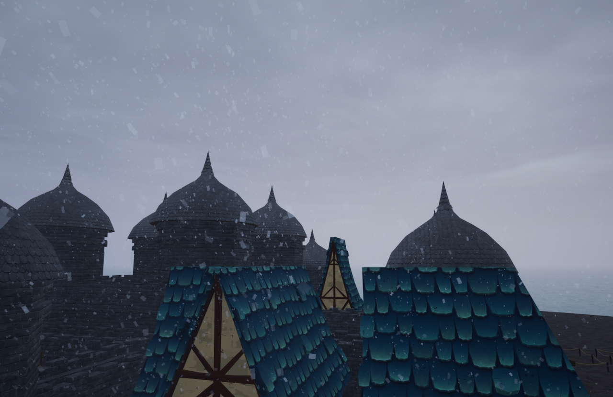
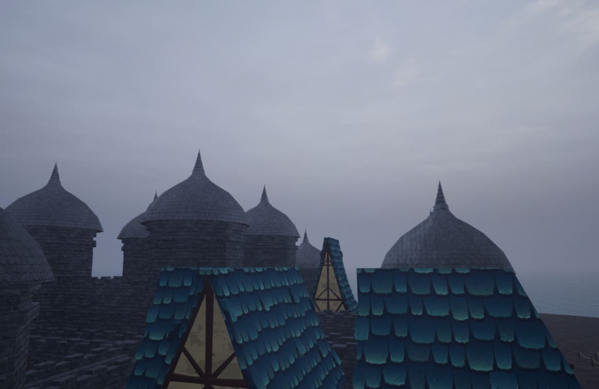

<link rel="stylesheet" href="/assets/css/style.css">

  

    <a href="/index.html">Home</a>
    <a href="/Projects/python.html">Python Projects</a>
    <a href="/Projects/cpp.html">C++ Projects</a>
    <a href="/Projects/games.html">Game Projects</a>
    <a href="/about.html">About Me</a>
  

 

# 🎮 Game Projects
A collection of prototypes and gameplay experiments.  
Each project explores mechanics, systems, or player interaction in a focused, iterative way.

---

  

# **[We Built This City: Farmer Edition](https://madteapartydevelopment.itch.io/we-built-this-city-farmer){:target="_blank" rel="noopener noreferrer"}** - Solo
A simple, farming sim I built as a challenge. I wanted to do it in a week. I used tick, I really shouldn't have, but I still think the game is beautiful. 

<iframe width="560" height="315"
  src="https://www.youtube.com/embed/o-LALVxg8F0?si=OONDBjha2vnRV3iz"
  frameborder="0"
  allowfullscreen>
</iframe>

---

  

# **[Scorchlet](https://madteapartydevelopment.itch.io/scorchlet){:target="_blank" rel="noopener noreferrer"}** - Solo
Scorchlet is a cute little dragon that you get to watch grow!
You interact with your dragon and watch it live it's life. 
You can feed it and tickle it too! 
It is also localized to 12 Languages(including English). 

  

    
  

  

    <iframe width="560" height="315"
      src="https://www.youtube.com/embed/u4AS8GVXCNI?si=uR1EygKVddr5bBis"
      frameborder="0"
      allowfullscreen>
    </iframe>
    <iframe width="560" height="315"
      src="https://www.youtube.com/embed/r8rPklq1FUg?si=539cKCF-CphlYqFN"
      frameborder="0"
      allowfullscreen>
    </iframe>
  

---

  

# **[Hero Impervious](https://madteapartydevelopment.itch.io/hero-impervious){:target="_blank" rel="noopener noreferrer"}** - Solo
This game is a twist on a typical RPG with some fascinating Simulation/Arcade aspects.  
I built it to be a rage game.  
It is essentially a giant ball physicals simulator. 

<iframe width="560" height="315"
  src="https://www.youtube.com/embed/kiyJKhMB2tg?si=x_0VCI41NMRU7MLo"
  frameborder="0"
  allowfullscreen>
</iframe>

---

  

## 🧪 Future Game Projects

---

### **Echoes of a Dream** - Solo
A psychological horror where you jump from nightmare to nightmare and reality becomes a distant memory. 

  

    
  

  

    
  

  <iframe width="560" height="315"
    src="https://www.youtube.com/embed/36LRIM3dotg?si=ffu-HENLCXthcDHh"
    frameborder="0"
    allowfullscreen>
  </iframe>

---

### **Afterimage** - Solo/Halted
A superhero semi-open world action rpg with heavy time travel mechanics and deep, layered narrative. 

  

    
  

  

    
  

  

---

### **Sam Hain** - Solo/Postponed
A stylized, fps based around halloween with a Terror Comic vibe. 

  

    
  

  

    
  

  <iframe width="560" height="315"
    src="https://www.youtube.com/embed/7i0oiYfdz24?si=tDD-VGNQmZZtooPC"
    frameborder="0"
    allowfullscreen>
  </iframe>

---

### **[Drake Forged](https://spicergames.com/drake-forged-main-page){:target="_blank" rel="noopener noreferrer"}** - Team
A semi-open world fantasy rpg with a deep narrative and even deeper mechanics. 

  

    
    
  

  

    
    
  

  

    
  

  

    
  

  <iframe width="560" height="315"
    src="https://www.youtube.com/embed/c4CSSQL0MRI?si=3rQWP3vf2MuzjCxt"
    frameborder="0"
    allowfullscreen>
  </iframe>

---

## 🔙 Back to Home 
- [Home](../index.md)

## Other Project Pages
- [C++](cpp.md)
- [Python](python.md)
