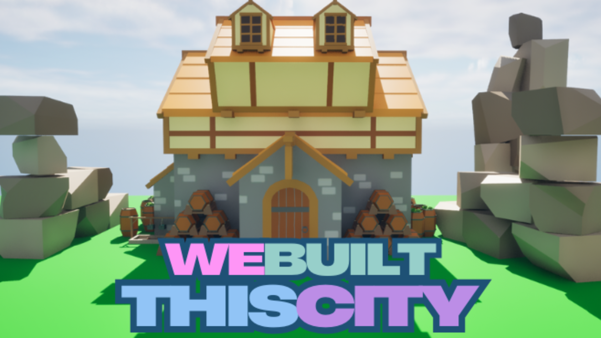
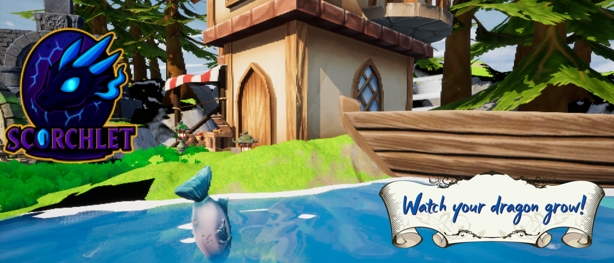
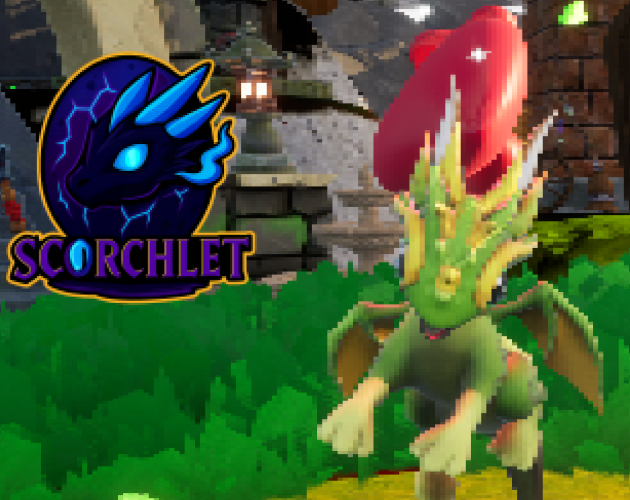
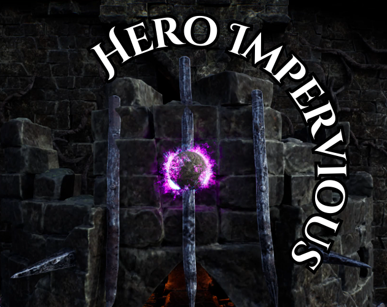
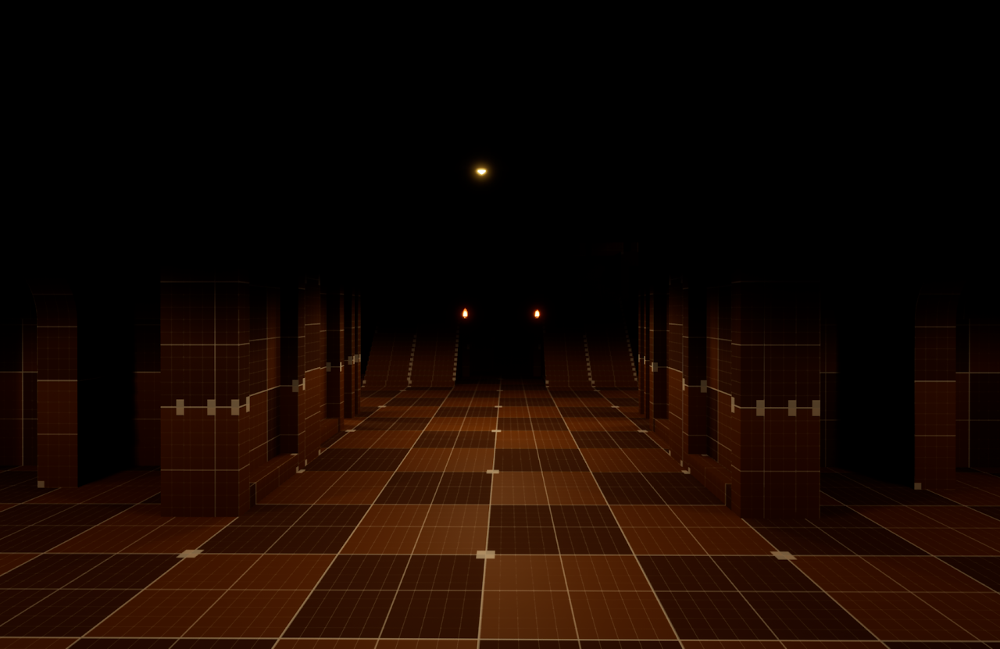
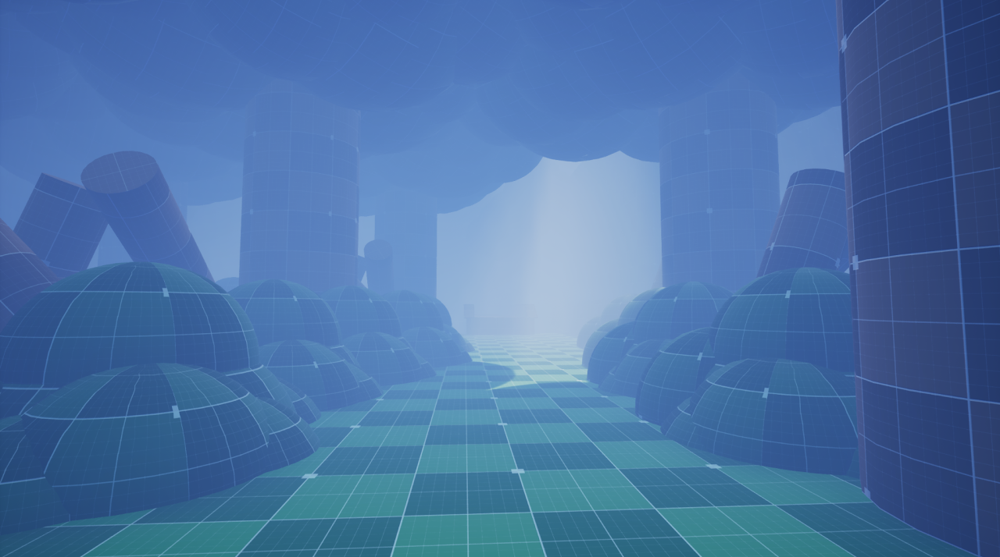
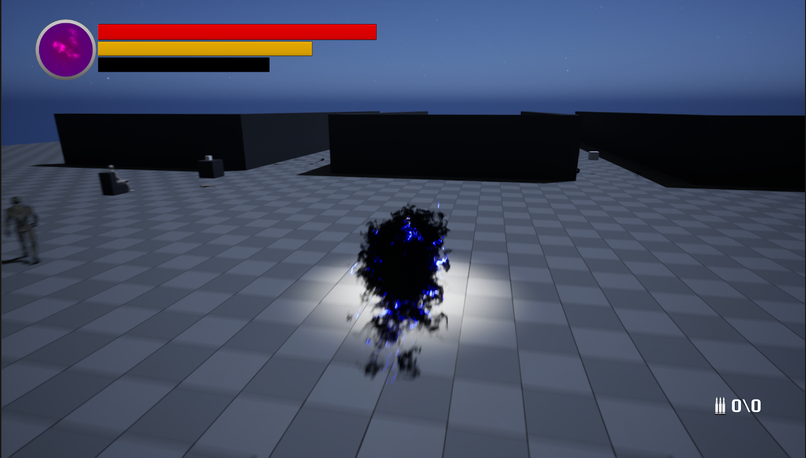
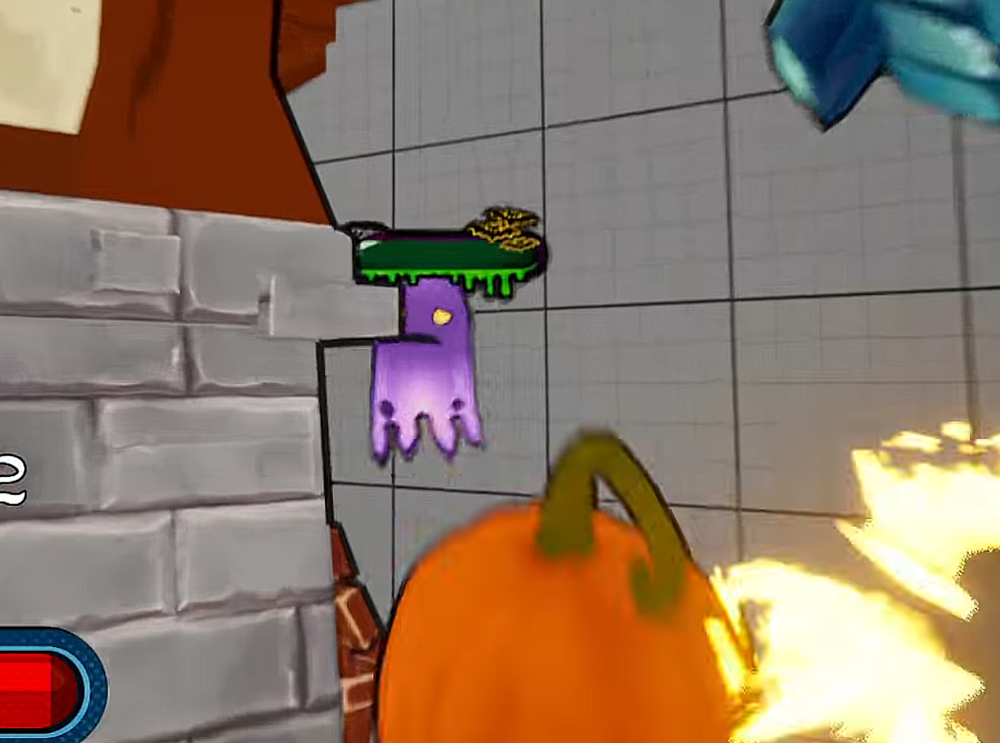
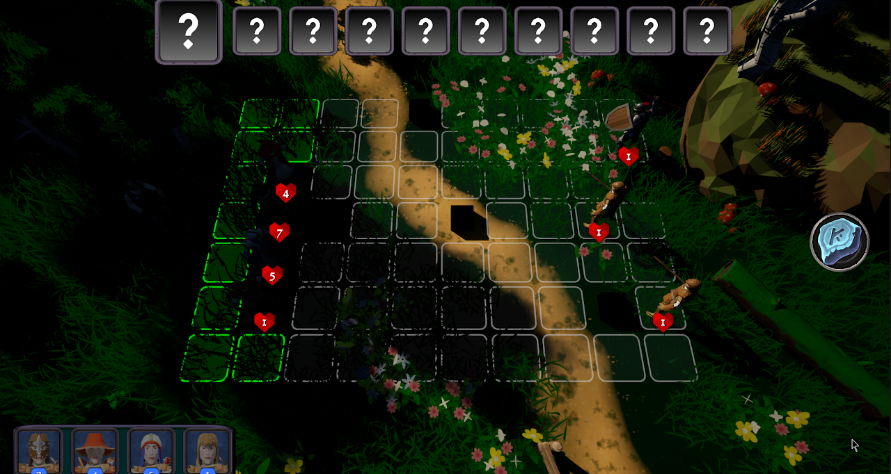

<link rel="stylesheet" href="/assets/css/style.css">

  <a href="/index.html" class="nav-brand">Alvie Spurlock</a>
  

    <a href="/Projects/games.html" class="nav-game">Game Development</a>
    <a href="/Projects/software.html" class="nav-soft">Software Engineering</a>
    <a href="/about.html">About</a>
  

<<<<<<< Updated upstream
 

# 🎮 Game Projects
A collection of prototypes and gameplay experiments. Most Importantly, Shipped Games! 
Each project explores mechanics, systems, or player interaction in a focused, iterative way.

---

  

# **[We Built This City: Farmer Edition](https://madteapartydevelopment.itch.io/we-built-this-city-farmer)** - Solo
A simple, farming sim I built as a challenge. I wanted to do it in a week. I used tick, I really shouldn't have, but I still think the game is beautiful. 

<iframe width="560" height="315"
  src="https://www.youtube.com/embed/o-LALVxg8F0?si=OONDBjha2vnRV3iz"
  frameborder="0"
  allowfullscreen>
</iframe>

---

  

# **[Scorchlet](https://madteapartydevelopment.itch.io/scorchlet)** - Solo
Scorchlet is a cute little dragon that you get to watch grow!
You interact with your dragon and watch it live it's life. 
You can feed it and tickle it too! 
It is also localized to 12 Languages(including English). 

  

    
  

  

    <iframe width="560" height="315"
      src="https://www.youtube.com/embed/u4AS8GVXCNI?si=uR1EygKVddr5bBis"
      frameborder="0"
      allowfullscreen>
    </iframe>
    <iframe width="560" height="315"
      src="https://www.youtube.com/embed/r8rPklq1FUg?si=539cKCF-CphlYqFN"
      frameborder="0"
      allowfullscreen>
    </iframe>
  

Scorchlet was also covered by Local News in The Odessa American! 
[Link!](https://www.oaoa.com/local-news/local-game-designer-builds-dragon-simulator-game/)
---

  

# **[Hero Impervious](https://madteapartydevelopment.itch.io/hero-impervious)** - Solo
This game is a twist on a typical RPG with some fascinating Simulation/Arcade aspects.  
I built it to be a rage game.  
It is essentially a giant ball physicals simulator. 

<iframe width="560" height="315"
  src="https://www.youtube.com/embed/kiyJKhMB2tg?si=x_0VCI41NMRU7MLo"
  frameborder="0"
  allowfullscreen>
</iframe>

---

  

## 🧪 Future Game Projects

---

### **Echoes of a Dream** - Solo
A psychological horror where you jump from nightmare to nightmare and reality becomes a distant memory. 

  

    
  

  

    
  

=======

  
Discipline 01

  <h1>Game Development</h1>
  
Shipped solo titles, in-development games, and team projects. Every game here was designed, built, and finished to be played.

  Shipped Released on itch.io
>>>>>>> Stashed changes

  

    
    

      
● Shipped · Solo

      <h3>Scorchlet</h3>
      
A virtual dragon companion you raise and interact with — feed it, tickle it, and watch it grow. Localized into 12 languages and covered by the Odessa American newspaper.

      

        Virtual Pet
        12 Languages
        Press Coverage
        Solo
      

      

        <a href="https://madteapartydevelopment.itch.io/scorchlet" class="btn btn-game" target="_blank">Play on itch.io →</a>
        <a href="https://www.oaoa.com/local-news/local-game-designer-builds-dragon-simulator-game/" class="btn btn-ghost" target="_blank">Press</a>
      

    

  

  

    
    

      
● Shipped · Solo

      <h3>Hero Impervious</h3>
      
A rage game built on large-scale ball physics simulation. A twist on the typical RPG with Simulation/Arcade mechanics — deliberately designed to frustrate and delight.

      

        Physics Sim
        RPG / Arcade
        Rage Game
        Solo
      

      

        <a href="https://madteapartydevelopment.itch.io/hero-impervious" class="btn btn-game" target="_blank">Play on itch.io →</a>
      

    

  

  

    
    

      
● Shipped · Solo

      <h3>We Built This City: Farmer Edition</h3>
      
A farming sim built as a personal challenge: make something beautiful in one week. Used Tick despite the limitations — and still shipped a complete, polished game.

      

        Farming Sim
        One-Week Build
        Solo
      

      

        <a href="https://madteapartydevelopment.itch.io/we-built-this-city-farmer" class="btn btn-game" target="_blank">Play on itch.io →</a>
      

    

  

  In Development Active and upcoming projects

  

    
    

      
In Development · Solo

      <h3>Echoes of a Dream</h3>
      
Psychological horror. Jump between nightmares as reality becomes a distant memory.

    

  

  

    
    

      
Halted · Solo

      <h3>Afterimage</h3>
      
Superhero semi-open world action RPG with heavy time-travel mechanics and a deep, layered narrative.

    

  

  

    
    

      
Postponed · Solo

      <h3>Sam Hain</h3>
      
A stylized FPS built around Halloween with a Terror Comic visual identity.

    

  

  

    
    

      
In Development · Team

      <h3>Drake Forged</h3>
      
Semi-open world fantasy RPG with a deep narrative and layered mechanics.

      <a href="https://spicergames.com/drake-forged-main-page" target="_blank">Project Page →</a>
    

  

  
<a href="/index.html">← Back to Portfolio</a>

  
Mad Tea Party Development · <a href="https://madteapartydevelopment.itch.io" target="_blank">itch.io</a>

