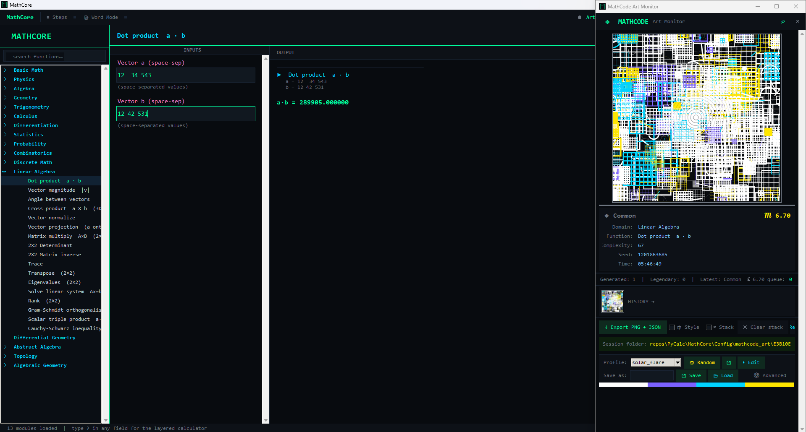
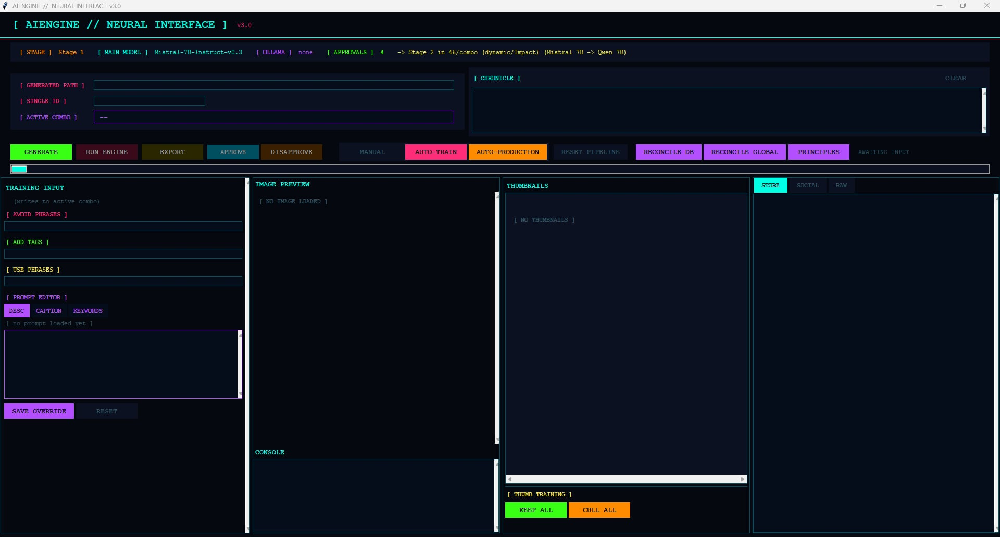

<link rel="stylesheet" href="/assets/css/style.css">

  

    <a href="/index.html">Home</a>
    <a href="/Projects/python.html">Python Projects</a>
    <a href="/Projects/cpp.html">C++ Projects</a>
    <a href="/Projects/games.html">Game Projects</a>
    <a href="/about.html">About Me</a>
  

# 🐍 Python Projects
A collection of tools, utilities, and backend systems built in Python.  
I focus on clean architecture, predictable behavior, and fast iteration.  
This page will grow as I continue building new tools.

---

## **[MathCore](https://github.com/AlvieSpurlock/MathCore)**
A modular mathematical computation library and generative art engine for Python.  
Covers 23 domains and 1,364 callable functions across pure mathematics and physics — and uses every calculation as direct input to a deterministic generative art system that turns each result into a unique, reproducible 3000×3000px artwork.

  

**Features**
- 23 modules spanning Algebra, Calculus, Trigonometry, Statistics, Probability, Combinatorics, Topology, Linear Algebra, Differential Geometry, Abstract Algebra, Algebraic Geometry, Discrete Math, and a full Physics suite
- 1,364 callable functions — all documented, input-validated, and dependency-free
- Generative art engine that maps function class, result value, and input values to visual parameters — stroke vocabulary, composition, color distribution, frequency, and focal geometry are all driven by the math
- Eight built-in visual profiles (Neon City, Deep Space, Solar Flare, Ice Grid, Organic, Monochrome, Chaos, Default)
- 3000×3000px default output with LANCZOS-quality preview downscaling
- Full Tkinter UI with searchable sidebar across all 23 modules
- Floating art monitor with session history, regen, and PNG export
- Rarity system: Common → Uncommon → Rare → Ultra Rare → Legendary

---

## **[SocialsAgent](https://github.com/AlvieSpurlock/SocialsAgent)**
An intelligent social automation tool that creates, optimizes, and posts content across multiple platforms with minimal input. All Open Source Code - Entirely Free to use.

  

**Features**
- Multi‑platform auto‑posting and listing
- ML‑trained AI generated captions, tags, and descriptions
- Engagement‑aware scheduling and optimization
*Perfect for streamlining content pipelines and reducing manual posting*

---

## 🔙 Back to Home
- [Home](../index.md)

## Other Project Pages
- [C++](cpp.md)
- [Games](games.md)
